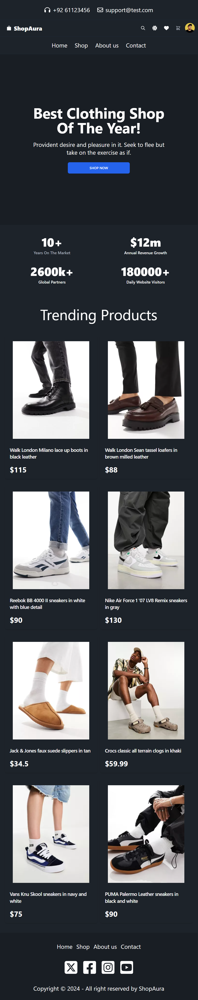
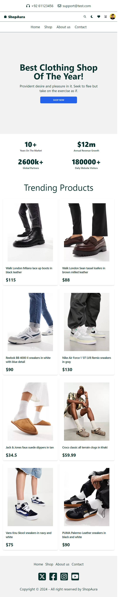
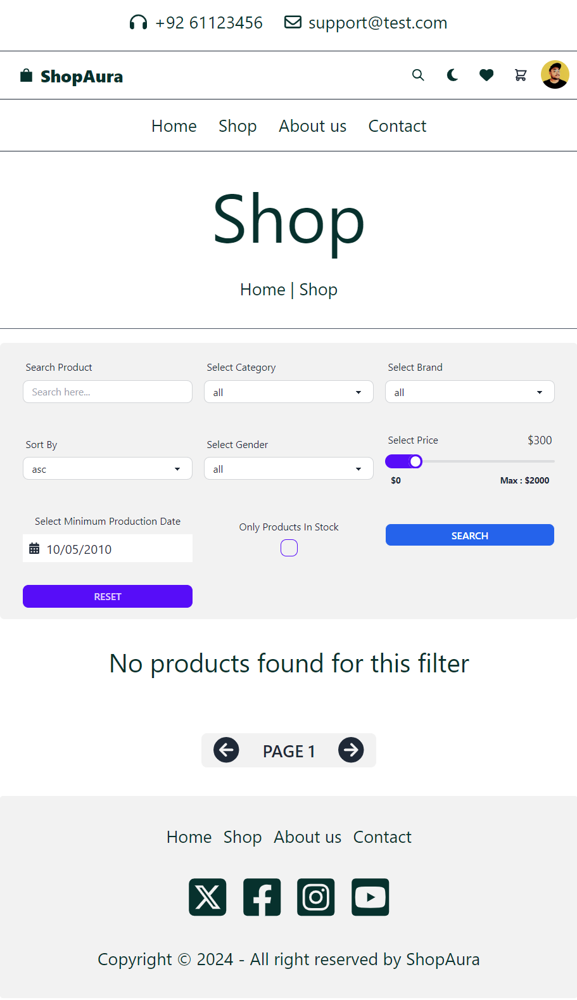
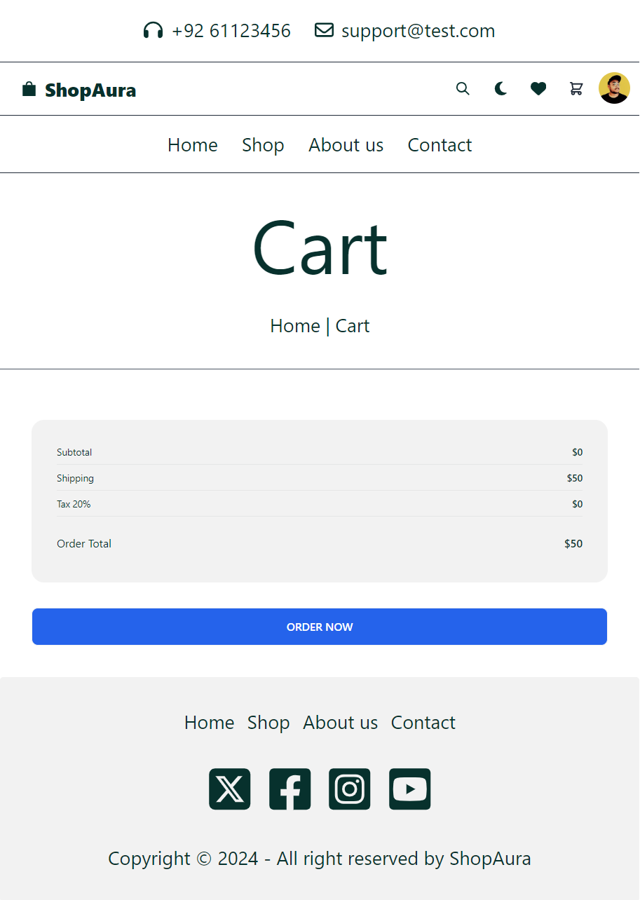
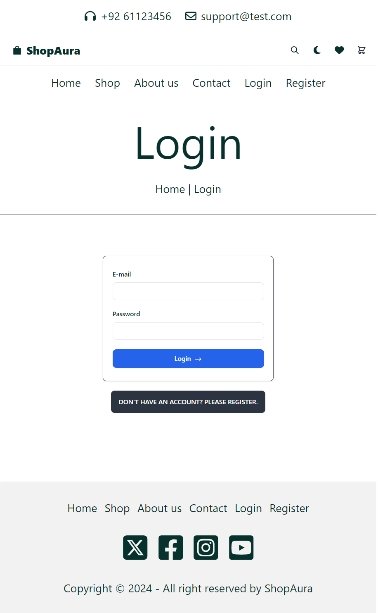
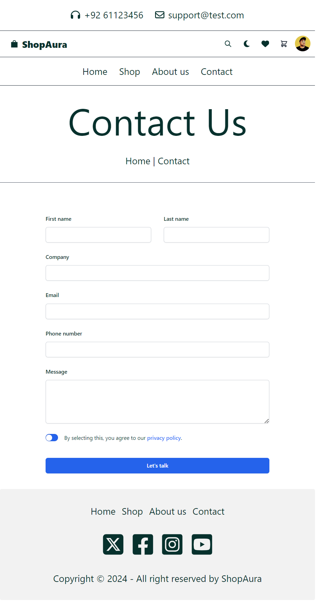

# ShopAura

Welcome to ShopAura, the ultimate destination for fashion enthusiasts seeking a sophisticated online shopping experience. This is the project I have made completely with React.js. ShopAura is an innovative e-commerce platform offering a diverse range of clothing and footwear. 

# Project Features
- React Ecommerce Frontend: A modern and clean interface that highlights our product catalog with elegance and style.
- React Ecommerce Filter: An easy-to-use filtering system that allows customers to sort products by category, price, and more.
- Ecommerce React Website: A full-featured website built on React that exemplifies best practices in web development and design.
- React Shopping App: More than just a website, a complete shopping application designed for seamless online transactions.

# Customization and Templates
- React Online Shop Template: Utilize my pre-designed templates as a solid foundation for creating your unique online shop.
- React Ecommerce Theme: My custom theme embodies the latest trends in web aesthetics, providing a chic backdrop for your merchandise.
- Free React Ecommerce Template: Jumpstart your project with my free template that offers a balance of design and functionality.

# Development Highlights
- Ecommerce Using React: My codebase showcases how React can be leveraged to build dynamic and responsive eCommerce sites.
- React Ecommerce App: The structure of the application is designed to serve as a robust React eCommerce platform.
- React Ecommerce Boilerplate: Developers can use this project as a boilerplate, enjoying a pre-configured environment that accelerates development cycles.

# Instructions
1. To run the app you first need to download and install Node.js and npm on your computer. When you download them you need to configure path variables. Here is the link where you can install them: [Node.js](https://nodejs.org/en)
2. When you install Node.js and npm on your computer you need to download the project. When you download the project, you need first to open the first terminal and write: npm install
3. After that in the same terminal write: npm run dev
4. The third step is mandatory if you don't have json-server installed on your computer. Open a second terminal write the following: npm install -g json-server
5. When you do it, you need to open a second terminal and run JSON server on port 8080. Just write in the second terminal: json-server --watch src/data/db.json --port 8080

# Key Features:
- User Accounts: Robust login and registration functionality, allowing customers to create and manage their personal accounts.
- Order Management: Users can view their order history
- Shopping Cart: A dynamic cart system where customers can add items, adjust quantities, or remove products as needed.
- Wishlist: Users can curate a list of desired items for future purchase, enhancing the shopping experience.
- Advanced Search and Filters: A powerful search engine with filters to sort products by price, date of addition, category, brand, gender, and stock availability.
- Category and Brand Sorting: Intuitive categorization and brand-specific pages for easier navigation and product discovery.
- Stock Indicators: Real-time updates on product availability to ensure customers are informed about in-stock items.

# Technologies Used:
Front-End: HTML5, CSS3, JavaScript (with React.js framework)

# Responsive Design:
Mobile-First Approach: The website is designed to be fully responsive and mobile-friendly, ensuring a consistent experience across all devices.

 Project screenshots:

# Home page in dark mode

# Home page in light mode

# Shop page

# Single product page

# Login page

# Contact Us page

